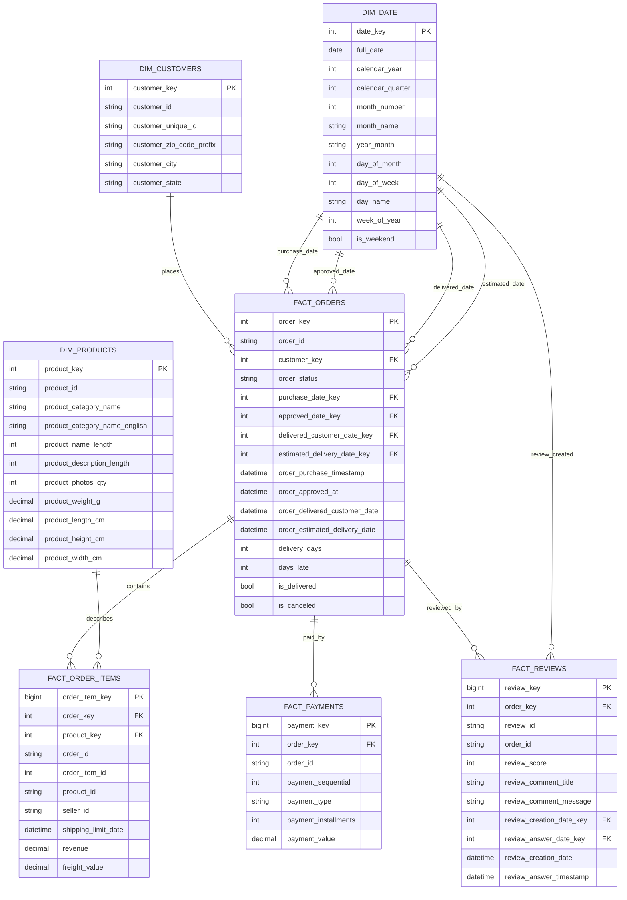

# ER Diagram

This model uses a star-schema warehouse layer for analytics and Power BI. The raw tables land CSV data first; the `dw` schema is the trusted reporting model.

## Relationship Notes

- `customer_id` is order-level in Olist. Use `customer_unique_id` for repeat purchase and retention analysis.
- `order_id` connects orders, order items, payments, and reviews in the raw source.
- `fact_order_items` is the revenue grain because one order can contain multiple products.
- `fact_payments` can have multiple rows per order due to split payment sequences.
- `fact_reviews` can contain more than one review row for an order, so reporting views select review scores carefully to avoid double-counting revenue.
- Revenue excludes freight. Freight is kept as `freight_value`.

